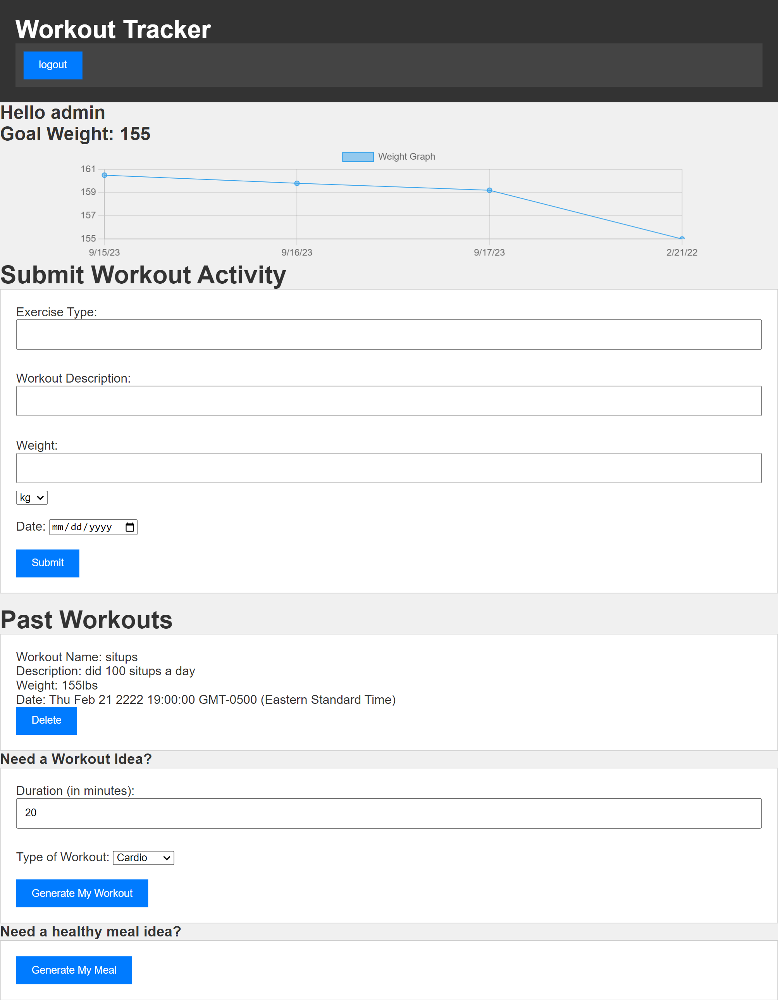
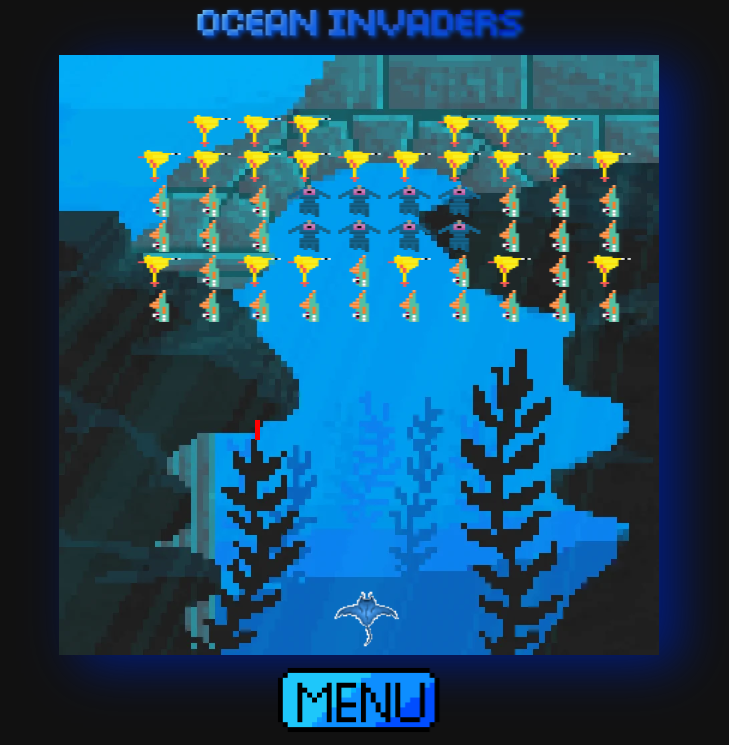

# Hello there! 👋 I'm Nick Heal

I am a dedicated Full Stack Developer with a passion for crafting robust, scalable backend solutions and creating seamless, user-friendly experiences. My coding journey revolves around building interactive and dynamic web applications, ensuring each component works harmoniously to deliver a seamless experience.

## ⚡ Technologies

## 🚀 What I'm Currently Up To

- 💻 Mastering the intricacies of React, creating interactive and dynamic user interfaces.
- 🛠️ Developing backend solutions with technologies like MongoDB, Mongoose, MySQL, and leveraging tools like Webpack for optimal performance.
- 🌐 Crafting end-to-end applications, bridging the gap between frontend elegance and backend functionality.

## 🚧 Project Demos

    
    

        

            Introducing G3 Fitness Tracker, a practical marvel designed to enhance your fitness journey. In this collaborative project, I integrated Express, MySQL, Sequelize, Chart.js, and OpenAI to create a seamless platform. It effortlessly tracks your progress, logs workouts, and delivers personalized suggestions, making fitness more accessible and engaging. 🏋️‍♂️✨
        

    

    
    

        

            Dive into nostalgia with Ocean Invaders, my first game crafted using Canvas and JavaScript at UCLA Coding Bootcamp. This retro recreation taught me crucial lessons in modular design and Canvas functionality, marking a significant milestone in my coding journey. 🎮✨
        

    

## 🌱 My Coding Philosophy

I thrive on solving intricate problems and turning innovative ideas into reality. I firmly believe in the power of clean code and user-centric design, ensuring every part of the application works harmoniously to deliver a seamless experience. Every line of code I write is a step toward making a meaningful difference in the digital landscape.

## 🤝 Seeking New Opportunities

I'm on the lookout for exciting opportunities to collaborate and contribute to passionate coding teams. Whether it's frontend development, backend architecture, or full-stack solutions, I'm eager to apply my knowledge and creativity to real-world projects. Let's create impactful applications and shape the future of technology together!

Feel free to reach out for collaborations, discussions, or if you just want to talk tech. 😊

